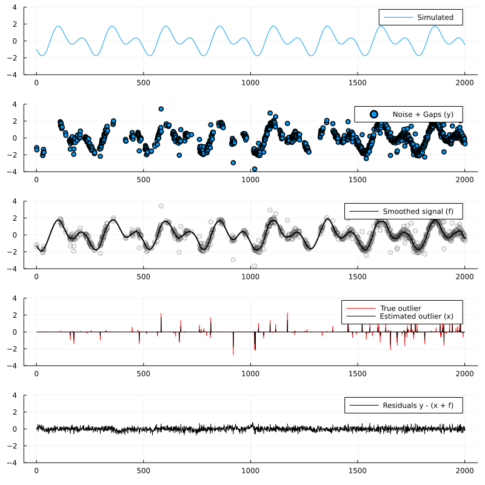

# DRAGO

Algorithm from [1]

[1] Parekh, A., et al. "Nonlinear Smoothing of Core Body Temperature Data with Random Gaps and Outliers (DRAGO)." Biomedical Signal Processing. Springer, Cham, 2021. 63-84.

